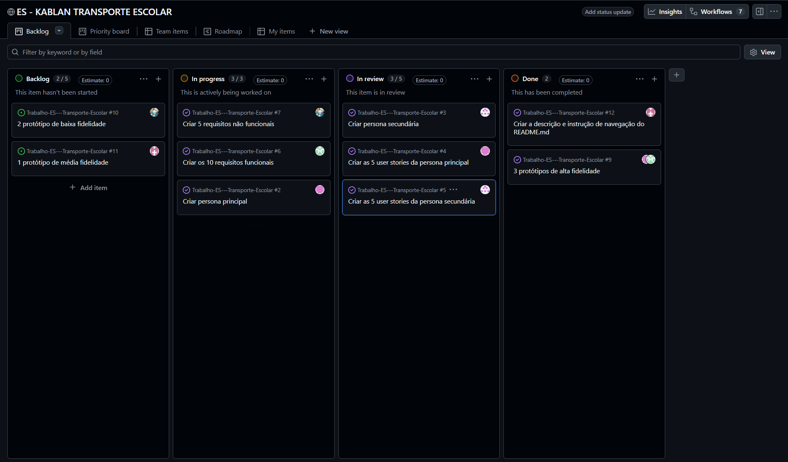

## Product Backlog Simplificado

| # |Prioridade|                User Story                    |                  Objetivo                 | Planning Poker |
|---|:--------:|----------------------------------------------|-------------------------------------------|:--------------:|
| 1 |   Alta   |Notificar em paradas noturnas                 |Reduzir ansiedade e aumentar segurança     |       5        | 
| 2 |   Alta   |Notificações automáticas e chat com a empresa |Praticidade na comunicação                 |       3        |
| 3 |   Alta   |Tempo estimado de rota                        |Maior previsibilidade dos horários         |       5        |
| 4 |   Alta   |Interface simplificada por voz para alertas   |Garantir comunicação com passageiros       |       2        |
| 5 |   Alta   |Visualizar bloqueios de trânsito em tempo real|Prever imprevistos e possíveis atrasos     |       8        |
| 6 |   Alta   |Botão de emergência/pânico                    |Rapidez em acionar a central em emergências|       3        |

## Organização das Tarefas

Utilizamos uma organização de tarefas no estilo Kanban, divindo a função de cada um e a etapa desse processo
