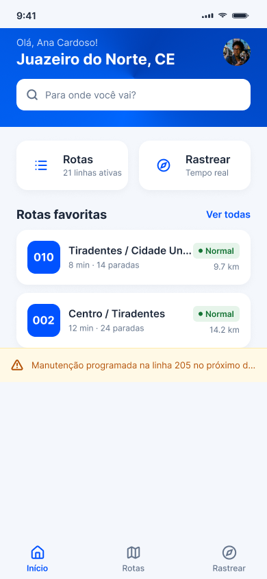
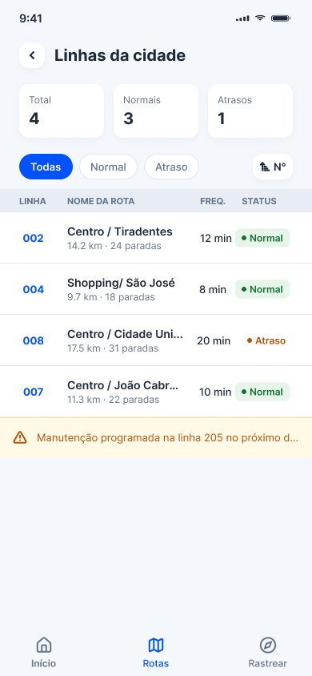
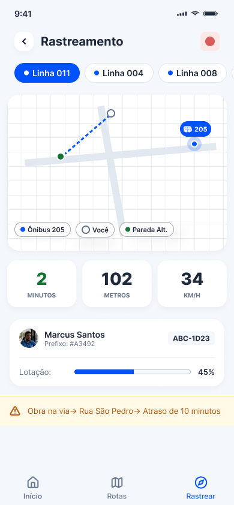
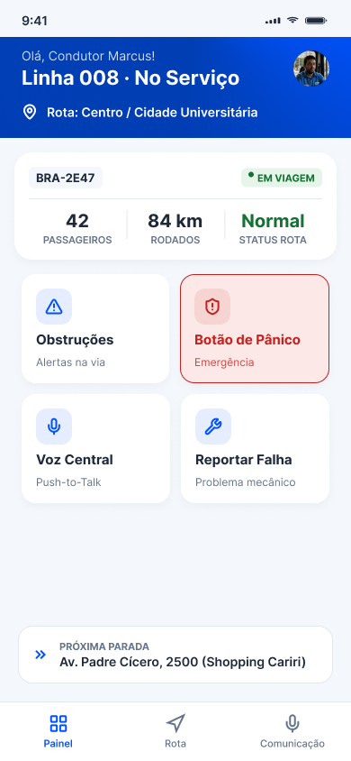
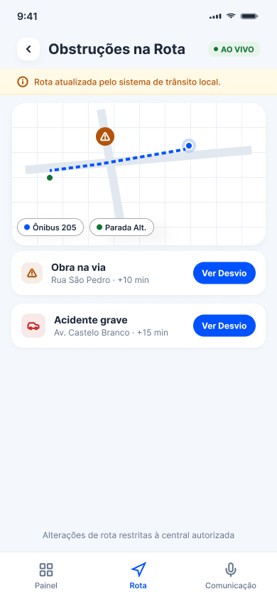
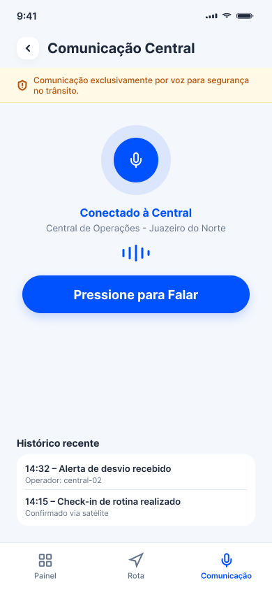
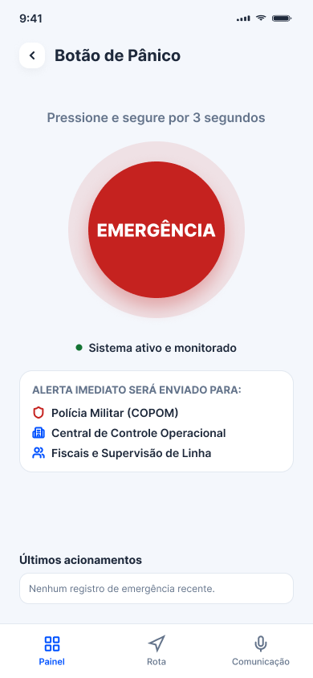
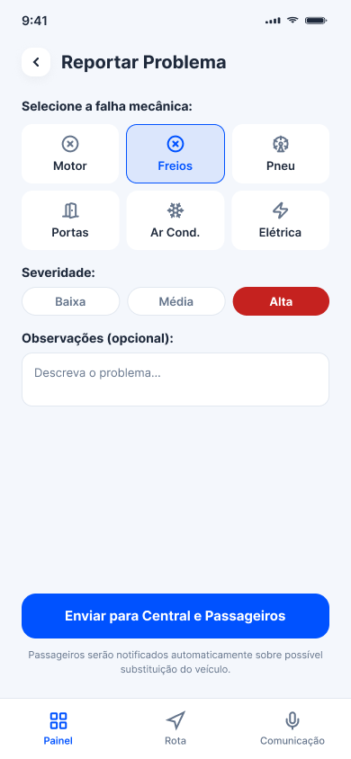

# Transporte Escolar – Protótipo de alta fidelidade  

## Personas

**Marcus Santos** (Motorista) 

**Ana Cardoso** (Estudante universitária)

## 📱 Tela 1 – Home do usuário (Ana)
  

---  

## 📱 Tela 2 – Lista de rotas (Ana)
  

---  

## 📱 Tela 3 – Rastreamento do ônibus (Ana)
_

---  
## 📱 Tela 4 – Home do motorista (Marcus)

---  

## 📱 Tela 5 – Rota do motorista (Marcus)

---  

## 📱 Tela 6 – Comunicação por voz(Marcus)
 

---  

## 📱 Tela 7 – Botão Pânico
  

---  

## 📱 Tela 8 – Reportar Problemas com o ônibus
  
